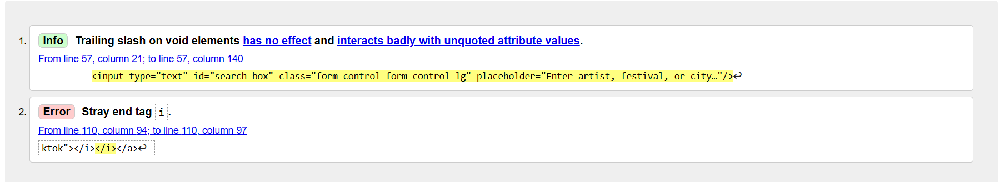
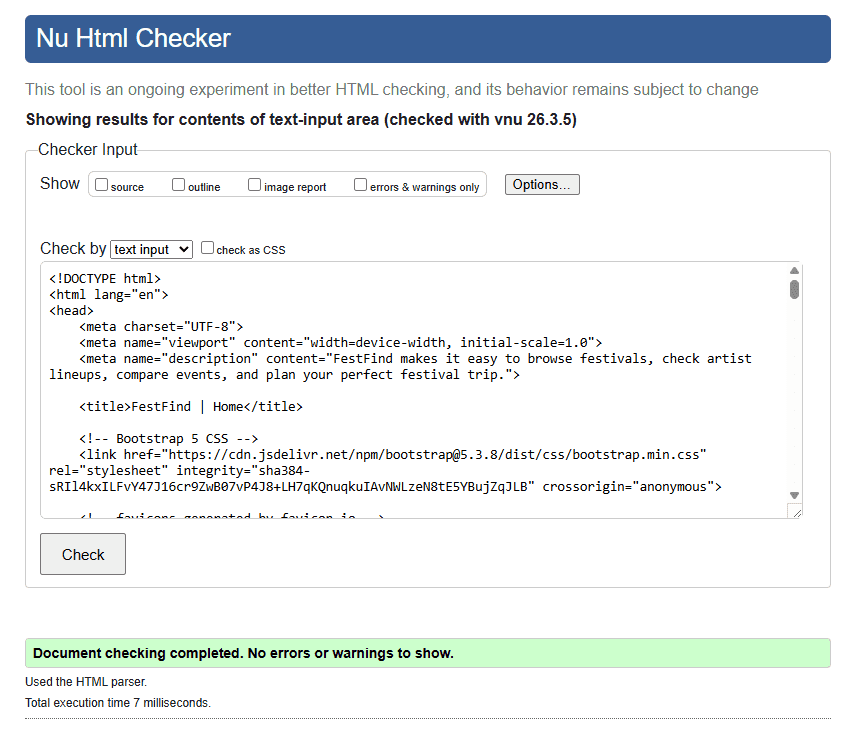
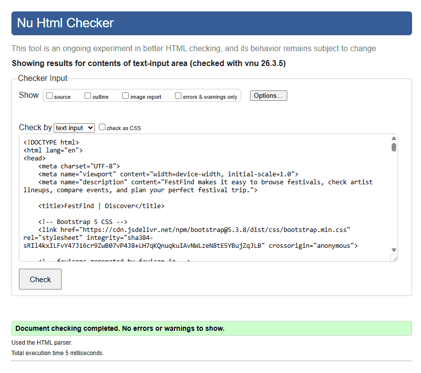
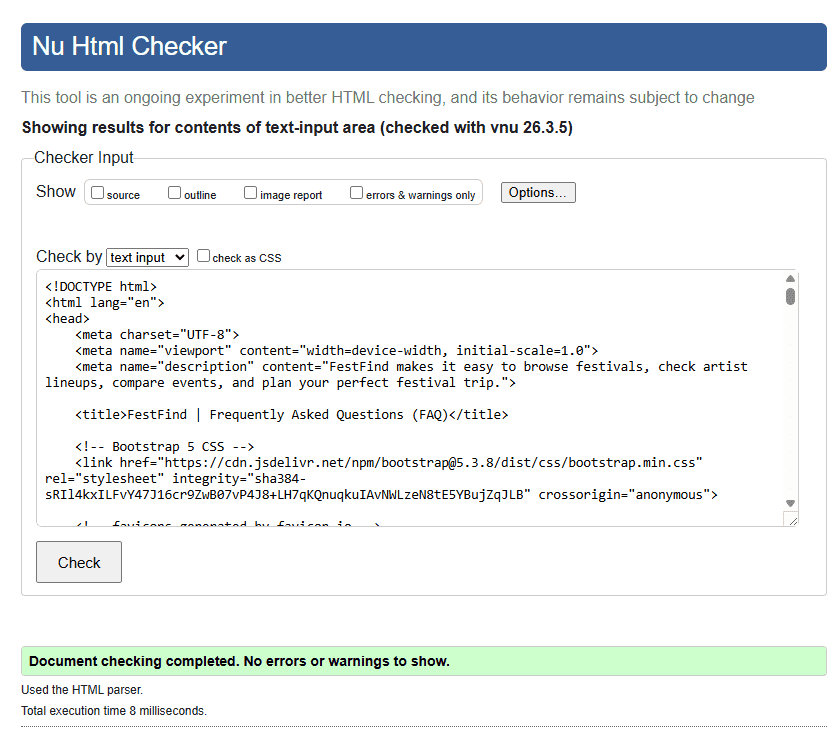
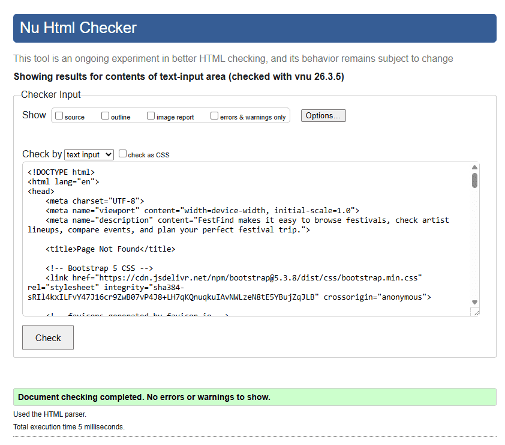
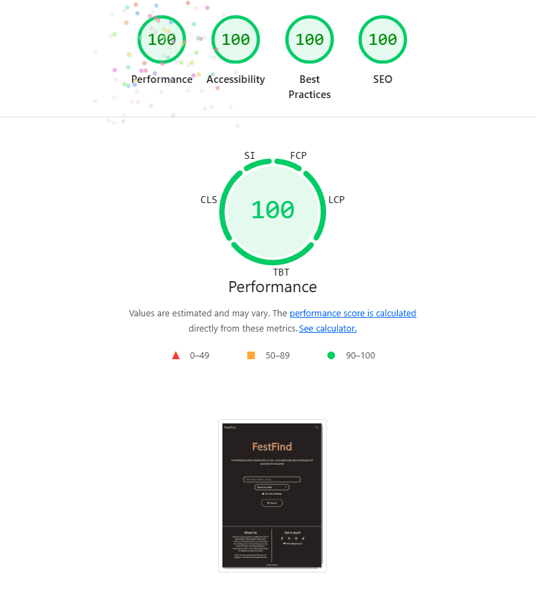
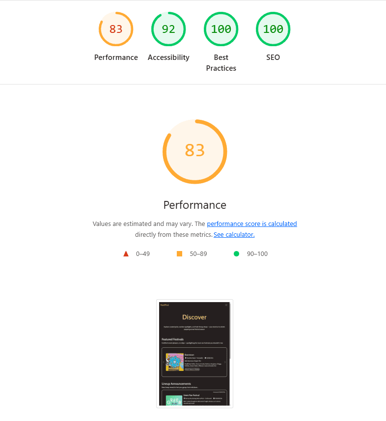
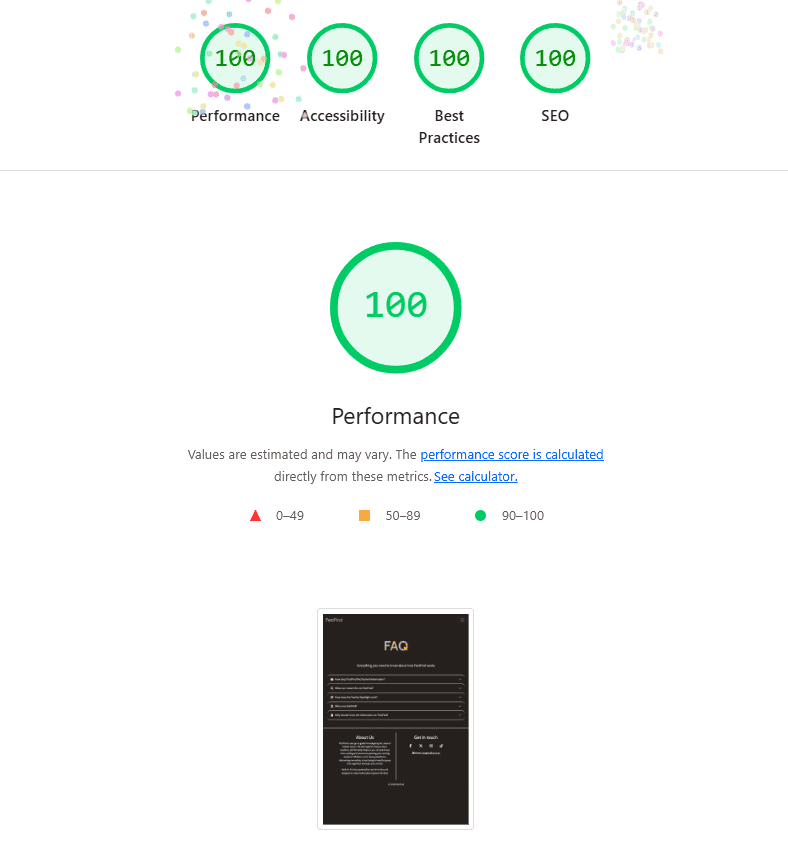
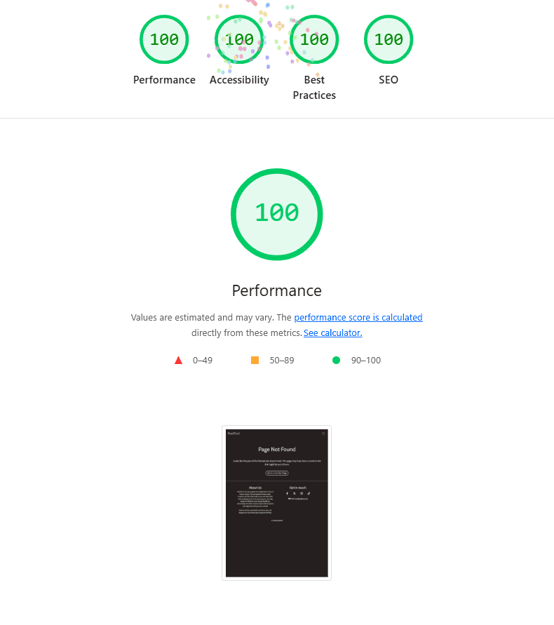

# Milestone Project Two - Testing Documentation

This document summarises all testing completed throughout development.

## CONTENTS

1. [ACCEPTANCE CRITERIA TESTING](#acceptance-criteria-testing)
2. [BEHAVIOUR DRIVEN DEVELOPMENT / MANUAL TESTING](#behaviour-driven-development--manual-testing)
3. [SOFTWARE TESTING / AUTOMATED TESTING](#software-testing--automated-testing)
4. [HTML VALIDATOR](#html-validator)
5. [CSS VALIDATOR](#css-validator)
6. [JEST / JAVASCRIPT VALIDATOR](#jest--javascript-validator)
7. [GOOGLE CHROME LIGHTHOUSE](#google-chrome-lighthouse)
8. [BUG FIXES](#bug-fixes)

### Acceptance Criteria Testing
This table outlines the key user stories and acceptance criteria completed during development. This demonstrates how the website meets the expectations of its target audience and ensures a satisfying user experience.

| User Story | Acceptance Criteria | Status |
|-----------|---------------------|--------|
| 1: User Friendly Navigation and Responsive Design (Must-Have) | The website is fully responsive across various devices and screen sizes, including mobile devices. | **✔ PASS** |
| 1: User Friendly Navigation and Responsive Design (Must-Have) | The structure and navigation are designed for clarity, providing straightforward access to different sections. | **✔ PASS** |
| 2: Robust Search (Must-Have) | The search accepts user input and returns matching results. | **✔ PASS** |
| 2: Robust Search (Must-Have) | A search‑mode dropdown (City / Festival / Artist) updates search behaviour and displayed results immediately. | **✔ PASS** |
| 2: Robust Search (Must-Have) | The UI shows clear states for searching, no results, and errors. | **✔ PASS** |
| 3: Discover Page (Must-Have) | The Discover page highlights curated festivals (carousel or cards) for easy browsing. | **✔ PASS** |
| 3: Discover Page (Must-Have) | A Festival Spotlight or Featured card shows detailed lineup information and a clear “View Festival” link. | **✔ PASS** |
| 3: Discover Page (Must-Have) | A Latest Announced Lineups section lists recently updated lineups. | **✔ PASS** |
| 4: Helpful Error Recovery Experience (Must-Have) | A custom 404 page exists with themed artwork and a prominent “Return Home” button. | **✔ PASS** |
| 4: Helpful Error Recovery Experience (Must-Have) | The page explains the error in plain language and offers navigation options. | **✔ PASS** |
| 4: Helpful Error Recovery Experience (Must-Have) | Using browser back/forward does not leave the site in a broken state. | **✔ PASS** |
| 5: FAQ Page (Should-Have) | An accessible accordion presents FAQ items and supports keyboard navigation and ARIA roles. | **✔ PASS** |
| 5: FAQ Page (Should-Have) | The FAQ contains clear, site‑specific explanations about how the website works and how to use key features. | **✔ PASS** |
| 6: Festival News Feed (Could-Have) | A Festival News section appears on the Discover page and displays recent festival‑related articles with title, source, date, and “Read More” link. | **⌛ NOT YET ADDRESSED** |
| 6: Festival News Feed (Could-Have) | Articles are automatically filtered to include only festival or lineup‑related content and update at a set interval. | **⌛ NOT YET ADDRESSED** |
| 6: Festival News Feed (Could-Have) | If the feed cannot load new data, a fallback message is shown and previously cached articles remain visible. | **⌛ NOT YET ADDRESSED** |

ADD WORDING TO EXPLAIN THIS.

### Behaviour Driven Development / Manual Testing
Explaining what manual testing is and how it's been used.

### Software Testing / Automated Testing
Explaining what automated testing is and how it's been used.

### HTML Validator 
- [W3C Validator](https://validator.w3.org/) was used to ensure that web standards are being met and there are no structural issues.
- This was first used after the development of the first page (home / search page) to ensure errors were not replicated in other pages.
- This was later used once the build stage of development had concluded. There were errors raised from the use of the Bootsrap accordion on the FAQ page. The validator error happens because a plain "div" is not allowed to use aria-labelledby unless it has a proper ARIA role. The fix is to add role="region" to the collapsible panel so it becomes a valid labelled section for assistive technologies. See commit ref 6cdcc43. 

-----

<i>W3C Validator Testing in Early Development</i>

-----

<i>Home / Search Page HTML Validator</i>

-----

<i>Discover Page HTML Validator</i>

-----

<i>FAQ Page HTML Validator</i>

-----

<i>404 Page HTML Validator</i>

-----

### CSS Validator
[Jigsaw CSS Validator](https://jigsaw.w3.org/css-validator/) was used to spot syntax mistakes and conflicting rules before they cause unpredictable layouts or styling glitches. There were no issues to fix within my style.css file.

### JSHint / JavaScript Validator
Completing JS testing and outlining the results.

Need to use: /* jshint esversion: 11 */ for JSHint

Also, all javascript code has been tested with: Google Developer Tools Console Tab.
- By displaying JavaScript errors and warnings for debugging.
- Executing JavaScript code from the console .

### Google Chrome Lighthouse
Google Lighthouse is a helpful auditing tool that checks performance, accessibility and best practice issues on a website. It is useful because it gives clear guidance on what needs improving and shows how changes affect the overall quality of the site. The scores receieved for each page have been included below.

<i>Home / Search Page Lighthouse Score</i>

  

-----

<i>Discover Page Lighthouse Score</i>

  

-----

<i>FAQ Page Lighthouse Score</i>

  

-----

<i>404 Page Lighthouse Score</i>

  

-----

As shown in the extracts above, all pages have received high scores. The Discover Page has a lower performance score, but this was anticipated due to the information loading. Below are the issues raised by Lighthouse that were addressed to ensure high scores (see commit ref 191c4ae):
- Select elements do not have associated label elements ('Search By' Mode Toggle)
- Links do not have a discernible name (Social media links in footer)
- Background and foreground colors do not have a sufficient contrast ratio (Email linked in the footer)
- Buttons do not have an accessible name (Toggle icon on navbar)

### Bug Fixes
This section documents the issues found during development and how each one was resolved. It provides a clear record of problems and fixes highlighted during manual testing.

<table>
  <thead>
    <tr>
      <th>Bug Title</th>
      <th>Bug Description</th>
      <th>Fixed?</th>
      <th>Fixed Description</th>
      <th>GitHub Commit Reference</th>
    </tr>
  </thead>
  <tbody>
    <tr>
      <td>1. xxxx</td>
      <td>xxxxx</td>
      <td>✔️ Fixed or ❌</td>
      <td>Fix: xxxx</td>
      <td>e.g b92dc9e</td>
    </tr>
    <tr>
      <td>2. xxxx</td>
      <td>xxxxx</td>
      <td>✔️ Fixed or ❌</td>
      <td>Fix: xxxx</td>
      <td>e.g b92dc9e</td>
    </tr>
    <tr>
      <td>3. xxxx</td>
      <td>xxxxx</td>
      <td>✔️ Fixed or ❌</td>
      <td>Fix: xxxx</td>
      <td>e.g b92dc9e</td>
    </tr>
    <tr>
      <td>4. xxxx</td>
      <td>xxxxx</td>
      <td>✔️ Fixed or ❌</td>
      <td>Fix: xxxx</td>
      <td>e.g b92dc9e</td>
    </tr>
    <tr>
      <td>5. xxxx</td>
      <td>xxxxx</td>
      <td>✔️ Fixed or ❌</td>
      <td>Fix: xxxx</td>
      <td>e.g b92dc9e</td>
    </tr>
  </tbody>
</table>

[*Back to contents*](#contents)

