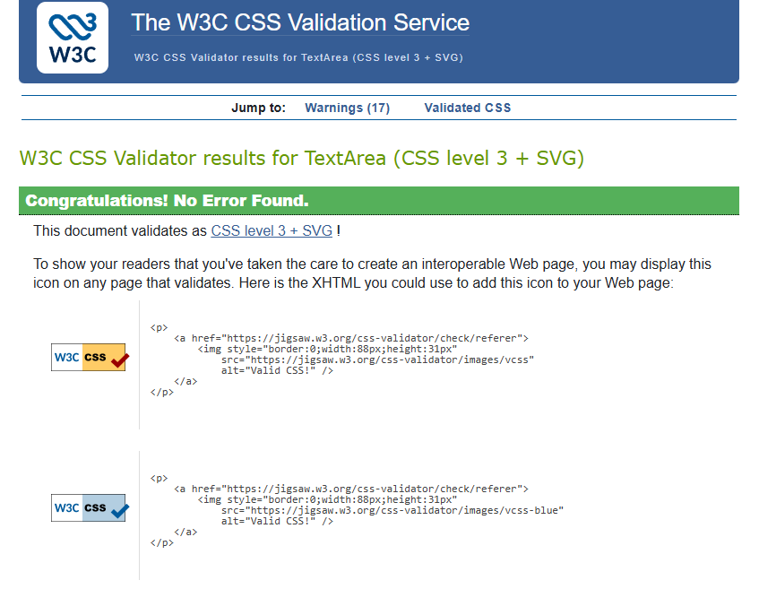
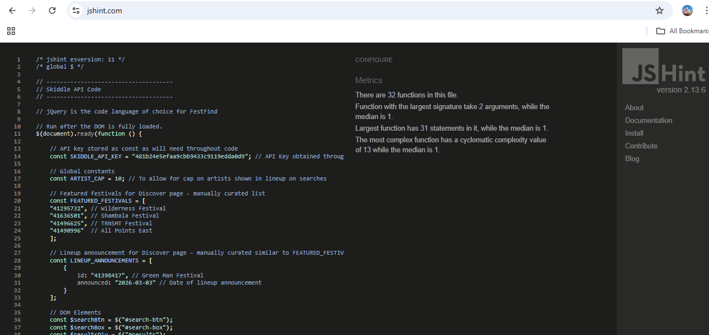
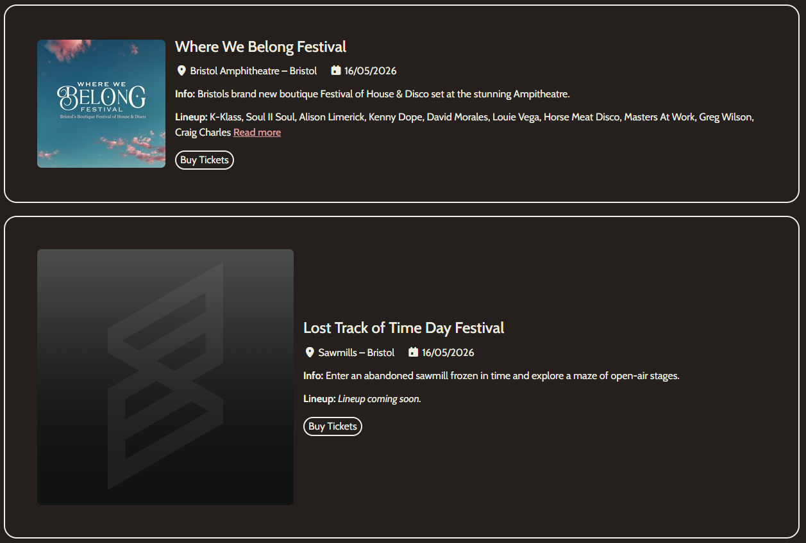

# Milestone Project Two - Testing Documentation 🧪

This document summarises all testing completed throughout development.

## CONTENTS

1. [BEHAVIOUR DRIVEN DEVELOPMENT / MANUAL TESTING](#behaviour-driven-development--manual-testing)
2. [AUTOMATED TESTING](#automated-testing)
3. [ACCEPTANCE CRITERIA TESTING](#acceptance-criteria-testing)
4. [HTML VALIDATOR](#html-validator)
5. [CSS VALIDATOR](#css-validator)
6. [JAVASCRIPT VALIDATOR](#javascript-validator)
7. [GOOGLE CHROME LIGHTHOUSE](#google-chrome-lighthouse)
8. [BUG FIXES](#bug-fixes)

### Behaviour Driven Development / Manual Testing
Behaviour driven development was used to guide the testing process. This method focuses on how a user expects a feature to behave and the aim is to check that the site behaves in a clear and predictable way. It also helps keep the focus on user needs rather than only on technical checks. These principles are met in the manual testing because each test follows a simple action and a clear expected result, and each one checks behaviour that matters to the user such as navigation, searching, loading data, and viewing festival details. Each feature was tested by hand to confirm that it worked as expected. This type of testing is useful because it shows how the site performs in real use and it helps find issues that automated tools may not detect. 

#### Navigation and Layout

| Feature | Expected Outcome | Testing Performed | Result | Pass/Fail |
| --- | --- | --- | --- | --- |
| Header links | Each link loads the correct page | Clicked each link | All links load the correct pages | **✔ PASS** |
| Logo link | Returns user to Home page | Clicked logo | Home page loads | **✔ PASS** |
| Desktop navigation | Navigation works on large screens | Tested on desktop | All links work and layout stays stable | **✔ PASS** |
| Tablet navigation | Navigation works on medium screens | Tested on tablet size | Layout adapts and links work | **✔ PASS** |
| Mobile menu | Menu opens and closes | Tapped menu icon | Menu opens and closes in a clear way | **✔ PASS** |
| Footer links | Footer links open correct pages | Clicked each link | All links open correct pages in new tabs where needed | **✔ PASS** |

#### Search Bar and Search Results

| Feature | Expected Outcome | Testing Performed | Result | Pass/Fail |
| --- | --- | --- | --- | --- |
| Valid search input | Shows festival results | Entered valid terms | Results appear in correct format | **✔ PASS** |
| Empty search input | Shows clear message | Submitted empty search | Clear message shown | **✔ PASS** |
| Long search input | Layout stays stable | Entered long text | Layout stays stable and no errors | **✔ PASS** |
| Special characters | Search handles unusual input | Entered special characters | No errors and message shown if no results | **✔ PASS** |
| Mixed case input | Returns correct results | Entered mixed case terms | Correct results shown | **✔ PASS** |
| Search result content | Shows name, date, location, image | Checked result cards | All fields display correctly, but bug identified where API pulls through large posters that impact formatting | **🐛 BUG IDENTIFIED** |
| External links | Cards link to Skiddle pages | Clicked each card | Correct Skiddle pages open for 'Check Tickets on Skiddle' button, but not for 'Buy Tickets' button | **🐛 BUG IDENTIFIED** |
| Updated results | New search updates results | Performed repeated searches | Results update each time | **✔ PASS** |
| No match message | Shows message when no results | Searched for unknown term | Clear no results message shown | **✔ PASS** |

#### Festival Cards and Event Details
| Feature | Expected Outcome | Testing Performed | Result | Pass/Fail |
| --- | --- | --- | --- | --- |
| Festival card content | Shows image, name, date | Checked cards | All fields display correctly | **✔ PASS** |
| Responsive card layout | Cards adapt to screen size | Tested on multiple devices | Layout stays stable | **✔ PASS** |
| Hover effects | Hover changes card state | Hovered on desktop | Hover effect works as expected, but noticed cursor issue on 'Read More' link | **🐛 BUG IDENTIFIED** |

#### Discover Page
| Feature | Expected Outcome | Testing Performed | Result | Pass/Fail |
| --- | --- | --- | --- | --- |
| Featured festivals | API data loads on page | Loaded Discover page | Featured festivals appear | **✔ PASS** |
| Lineup announcements | Shows title and date | Checked announcement cards | All cards show correct info | **✔ PASS** |
| Announcement links | Cards open correct pages | Clicked each card | Correct external pages open | **✔ PASS** |
| Responsive layout | Cards display well on all screens | Tested on multiple sizes | Layout stays clean and readable | **✔ PASS** |
| Loading state | Shows loading message | Loaded page on slow connection | Loading state appears | **✔ PASS** |
| Error state | Shows fallback message | Simulated API error | Clear fallback message shown | **✔ PASS** |

#### API Behaviour
| Feature | Expected Outcome | Testing Performed | Result | Pass/Fail |
| --- | --- | --- | --- | --- |
| Initial API load | Data loads on first visit | Loaded pages | Data loads correctly | **✔ PASS** |
| API error handling | Shows fallback message | Simulated API error | Clear fallback message shown | **✔ PASS** |
| Data refresh | Data updates on reload | Refreshed pages | Updated data appears | **✔ PASS** |
| Data format | Data displays in correct layout | Checked all API sections | All data displays correctly | **✔ PASS** |

#### Error Handling
| Feature | Expected Outcome | Testing Performed | Result | Pass/Fail |
| --- | --- | --- | --- | --- |
| 404 page | 404 page appears when incorrect url is entered | Entered incorrect url | 404 page appears | **✔ PASS** |
| Broken link handling | User sees a clear error message | Clicked a broken or edited link | Error page loads with clear message | **✔ PASS** |
| API failure message | Fallback message appears when API fails | Simulated API error | Fallback message appears on page | **✔ PASS** |
| Missing image handling | Default image appears when API image is missing | Removed image url in test | Default image displays correctly | **✔ PASS** |

#### Performance and Responsiveness
| Feature | Expected Outcome | Testing Performed | Result | Pass/Fail |
| --- | --- | --- | --- | --- |
| Page load speed | Pages load in reasonable time | Loaded each page | All pages load quickly | **✔ PASS** |
| Mobile layout | Layout adapts to small screens | Tested on mobile | Layout clean with no overlap | **✔ PASS** |
| Tablet layout | Layout adapts to medium screens | Tested on tablet | Layout stable and readable | **✔ PASS** |
| No horizontal scroll | No sideways scrolling on mobile | Tested on small screens | No horizontal scroll present | **✔ PASS** |

See [bug fixes table](#bug-fixes) where the identified issues were logged.

### Automated Testing
Automated testing checks code behaviour by running tests through a tool or script rather than by hand. Its key principles are repeatability, consistency, and early detection of errors. Automated tests run the same steps every time, which removes human error and makes it easier to spot issues when new features are added. They are useful for checking functions, input handling, and any part of the code that should always behave in the same way. 

At the time of submission automated testing had not been used, but it could be added through Jest. Jest is a JavaScript testing framework that can run small, repeatable tests on functions and components to confirm that they behave as expected. It could be used to test that the search function returns the correct results for valid input, that empty or invalid input is handled safely, and that API responses are processed without causing errors.

### Acceptance Criteria Testing
This table outlines the key user stories and acceptance criteria completed during development. This demonstrates how the website meets the expectations of its target audience and ensures a satisfying user experience.

| User Story | Acceptance Criteria | Status |
|-----------|---------------------|--------|
| 1: User Friendly Navigation and Responsive Design (Must-Have) | The website is fully responsive across various devices and screen sizes, including mobile devices. | **✔ PASS** |
| 1: User Friendly Navigation and Responsive Design (Must-Have) | The structure and navigation are designed for clarity, providing straightforward access to different sections. | **✔ PASS** |
| 2: Robust Search (Must-Have) | The search accepts user input and returns matching results. | **✔ PASS** |
| 2: Robust Search (Must-Have) | A search‑mode dropdown (City / Festival / Artist) updates search behaviour and displayed results immediately. | **✔ PASS** |
| 2: Robust Search (Must-Have) | The UI shows clear states for searching, no results, and errors. | **✔ PASS** |
| 3: Discover Page (Must-Have) | The Discover page highlights curated festivals (carousel or cards) for easy browsing. | **✔ PASS** |
| 3: Discover Page (Must-Have) | A Festival Spotlight or Featured card shows detailed lineup information and a clear “View Festival” link. | **✔ PASS** |
| 3: Discover Page (Must-Have) | A Latest Announced Lineups section lists recently updated lineups. | **✔ PASS** |
| 4: Helpful Error Recovery Experience (Must-Have) | A custom 404 page exists with themed artwork and a prominent “Return Home” button. | **✔ PASS** |
| 4: Helpful Error Recovery Experience (Must-Have) | The page explains the error in plain language and offers navigation options. | **✔ PASS** |
| 4: Helpful Error Recovery Experience (Must-Have) | Using browser back/forward does not leave the site in a broken state. | **✔ PASS** |
| 5: FAQ Page (Should-Have) | An accessible accordion presents FAQ items and supports keyboard navigation and ARIA roles. | **✔ PASS** |
| 5: FAQ Page (Should-Have) | The FAQ contains clear, site‑specific explanations about how the website works and how to use key features. | **✔ PASS** |
| 6: Festival News Feed (Could-Have) | A Festival News section appears on the Discover page and displays recent festival‑related articles with title, source, date, and “Read More” link. | **◐ PARTIALLY MET** |
| 6: Festival News Feed (Could-Have) | Articles are automatically filtered to include only festival or lineup‑related content and update at a set interval. | **◐ PARTIALLY MET**|
| 6: Festival News Feed (Could-Have) | If the feed cannot load new data, a fallback message is shown and previously cached articles remain visible. | **◐ PARTIALLY MET** |

#### User Story 6 Assessment
The approach to this user story changed during the project as other features were built and the overall structure of the site became clearer. This user story was always marked as a could‑have, so it sat outside the core goals of the project. A second API was not added which meant not all acceptance criteria for User Story 6 were fully met. Bringing in another data source would have increased the complexity of the build and made the project harder to maintain without offering a clear benefit to the user. The Skiddle API already provided strong festival data so a simple news style section was created from this instead. Key lineup updates were selected and each update includes a clear announcement date so users can see recent changes at a glance. This means the user story is partly achieved because the Discover page still presents fresh festival information even though it is not a full live news feed with automated articles.

An assessment of each acceptence criteria associated with User Story 6 has been included below:
- **A Festival News section appears on the Discover page and displays recent festival related articles with a title, source, date, and “Read More” link.**
  - The Discover page includes a lineup announcement section that shows recent festival updates taken from Skiddle data. Each update has a clear title and a date so users can see when the news was announced. This gives a simple way to view fresh festival information in one place.
- **Articles are automatically filtered to include only festival or lineup related content and update at a set interval.**
  - The site does not use automated filtering or timed updates. Instead, the lineup announcements are selected to keep the content focused on festival news. This keeps the section relevant and easy to understand without extra data sources.
- **If the feed cannot load new data, a fallback message is shown and previously cached articles remain visible.**
  - The site does not use a live feed so a fallback message is not needed. The lineup announcements are static and always visible. This means the section never appears empty or broken and users always see clear and reliable information.

### HTML Validator 
- [W3C Validator](https://validator.w3.org/) was used to ensure that web standards are being met and there are no structural issues.
- This was first used after the development of the first page (home / search page) to ensure errors were not replicated in other pages.
- This was later used once the build stage of development had concluded. There were errors raised from the use of the Bootsrap accordion on the FAQ page. The validator error happens because a plain "div" is not allowed to use aria-labelledby unless it has a proper ARIA role. The fix is to add role="region" to the collapsible panel so it becomes a valid labelled section for assistive technologies. See commit ref 6cdcc43. 

- **W3C Validator Testing in Early Development**
  - 

- **Home / Search Page HTML Validator**
  - 

- **Discover Page HTML Validator**
  - 

- **FAQ Page HTML Validator**
  - 

- **404 Page HTML Validator**
  - 

### CSS Validator
[W3C CSS Validator](https://jigsaw.w3.org/css-validator/) was used to spot syntax mistakes and conflicting rules before they cause unpredictable layouts or styling glitches. There were no issues to fix within my style.css file.

### JavaScript Validator
A JavaScript validator was used to check the code and make sure it followed good standards. [JSHint](https://jshint.com/) is a tool that scans JavaScript and points out errors, unused code, and common issues. It also highlights parts of the script that may not work as expected in some browsers. JSHint was set to use esversion 11 because the project uses jQuery and this version supports the features needed for it. This validator highlighted the following two small warnings:
- Misleading line break before '?'; readers may interpret this as an expression boundary (line 182).
- Missing semicolon (line 208).

These two warnings were addressed - see commit reference 2d04777.

### Google Chrome Lighthouse
Google Lighthouse is a helpful auditing tool that checks performance, accessibility and best practice issues on a website. It is useful because it gives clear guidance on what needs improving and shows how changes affect the overall quality of the site. The scores receieved for each page have been included below.

- Home / Search Page Lighthouse Score
  - 

- Discover Page Lighthouse Score
  - 

- FAQ Page Lighthouse Score
  - 

- 404 Page Lighthouse Score
  - 

As shown in the extracts above, all pages have received high scores. The Discover Page has a lower performance score, but this was anticipated due to the information loading. Below are the issues raised by Lighthouse that were addressed to ensure high scores (see commit ref 191c4ae):
- Select elements do not have associated label elements ('Search By' Mode Toggle)
- Links do not have a discernible name (Social media links in footer)
- Background and foreground colors do not have a sufficient contrast ratio (Email linked in the footer)
- Buttons do not have an accessible name (Toggle icon on navbar)

### Bug Fixes
This section documents the issues found during development and how each one was resolved. It provides a clear record of problems and fixes highlighted during manual testing.

<table>
  <thead>
    <tr>
      <th>Bug Title</th>
      <th>Bug Description</th>
      <th>Fixed?</th>
      <th>Fixed Description</th>
      <th>GitHub Commit Reference</th>
    </tr>
  </thead>
  <tbody>
    <tr>
      <td>(1) Broken 'Buy Tickets' Link</td>
      <td>Where Skiddle API has web links to purchase tickets, the JavaScript is supposed to make this available and show the 'Buy Tickets' button. The button is showing but the link is broken and loads a 404 page.</td>
      <td>✔️ Fixed or ❌</td>
      <td>Fix: xxxx</td>
      <td>e.g b92dc9e</td>
    </tr>
    <tr>
      <td>(2) 'Read More' Cursor</td>
      <td>On card containers for festival details, there is a 'Read More' option for lineup information. This button works but it's not showing a hand pointer / link cursor</td>
      <td>✔️ Fixed</td>
      <td>The update was made by using the existing .read-more-link:hover CSS rule so the element now displays a pointer cursor on hover, making its interactive behaviour clear.</td>
      <td>e0cbdda</td>
    </tr>
    <tr>
      <td>(3) Large Placeholder Festival Posters</td>
      <td>Some festival posters appear to have a placeholder given by Skiddle based on the use of the Skiddle logo. When this occurs the poster is much larger than the usual poster formatting. A screenshot of an example of this has been included below. The majority of festivals aren't impacted by this bug and does not impact the usability of the website.</td>
      <td>✔️ Fixed or ❌</td>
      <td>Fix: xxxx</td>
      <td>e.g b92dc9e</td>
    </tr>
  </tbody>
</table>

<em>Screenshot of Bug 3:</em>

[*Back to contents*](#contents)

